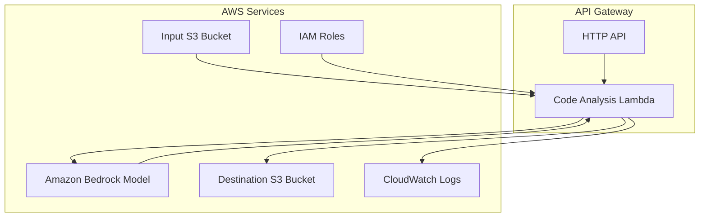
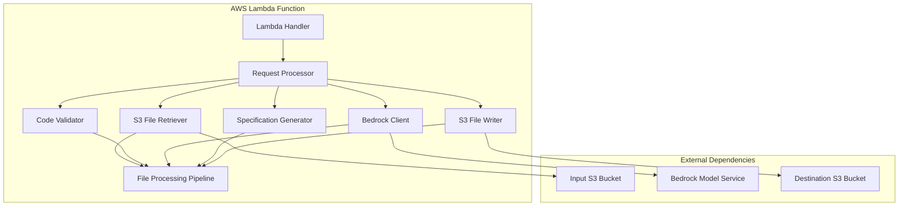

# Design Document

## Overview

The Code Analysis Agent is a Strands Agent deployed on Amazon Bedrock AgentCore Runtime that automatically processes programming code files from S3 and generates comprehensive design specifications. The system leverages Amazon Bedrock foundation models to analyze code structure, functionality, and architecture patterns, then outputs structured design documentation to a destination S3 bucket.

The agent follows a serverless, event-driven architecture that can scale automatically based on demand while maintaining security through proper IAM permissions and session isolation provided by Bedrock AgentCore Runtime.

## Architecture

### High-Level Architecture



### Component Architecture



## Components and Interfaces

### 1. Lambda Handler Component

**Purpose**: Provides the main entry point for AWS Lambda function execution.

**Interface**:
- `lambda_handler(event, context)`: Main Lambda function handler
- Processes API Gateway HTTP requests
- Returns proper HTTP response format

**Implementation**: Python Lambda function with Strands Agent integration

### 2. Request Processor Component

**Purpose**: Orchestrates the entire code analysis workflow within the Lambda function.

**Interface**:
```python
class CodeAnalysisRequest(BaseModel):
    s3_bucket: str
    s3_key: str
    destination_bucket: str
    model_id: Optional[str] = None

class CodeAnalysisResponse(BaseModel):
    statusCode: int
    body: str  # JSON string containing analysis results
```

**Key Methods**:
- `process_code_analysis(event: Dict) -> Dict`
- `validate_lambda_input(event: Dict) -> CodeAnalysisRequest`
- `format_lambda_response(result: Dict, status_code: int) -> Dict`

### 3. S3 File Retriever Component

**Purpose**: Retrieves code files from the input S3 bucket with proper error handling.

**Interface**:
```python
class S3FileRetriever:
    def retrieve_file(self, bucket: str, key: str) -> FileContent
    def validate_file_size(self, file_size: int) -> bool
    def get_file_metadata(self, bucket: str, key: str) -> Dict
```

**Features**:
- File size validation (max 1MB)
- Support for common programming file extensions
- Retry logic with exponential backoff
- Proper error handling for missing files

### 4. Code Validator Component

**Purpose**: Validates that retrieved files contain valid programming code.

**Interface**:
```python
class CodeValidator:
    def is_supported_file_type(self, filename: str) -> bool
    def validate_code_content(self, content: str, file_extension: str) -> bool
    def detect_programming_language(self, content: str, filename: str) -> str
```

**Supported File Types**: .py, .js, .java, .cpp, .cs, .go, .rb, .php, .ts

### 5. Bedrock Client Component

**Purpose**: Interfaces with Amazon Bedrock models for code analysis.

**Interface**:
```python
class BedrockAnalysisClient:
    def analyze_code(self, code_content: str, filename: str, language: str) -> str
    def format_prompt(self, code_content: str, metadata: Dict) -> str
    def handle_bedrock_errors(self, error: Exception) -> None
```

**Configuration**:
- Default model: Claude 3.5 Sonnet (`anthropic.claude-3-5-sonnet-20241022-v2:0`)
- Retry logic: 3 attempts with exponential backoff
- Temperature: 0.3 for consistent analysis
- Max tokens: 4000 for comprehensive specifications

### 6. Specification Generator Component

**Purpose**: Formats the Bedrock model output into structured design specifications.

**Interface**:
```python
class SpecificationGenerator:
    def generate_specification(self, analysis: str, metadata: Dict) -> str
    def format_as_markdown(self, content: Dict) -> str
    def add_metadata_header(self, filename: str, timestamp: str) -> str
```

**Output Format**:
```markdown
# Design Specification for {filename}

**Analysis Date**: {timestamp}
**Original File**: {filename}
**Programming Language**: {detected_language}

## Code Purpose
[AI-generated description of what the code does]

## Main Functions and Components
[AI-generated breakdown of key functions and classes]

## Data Structures
[AI-generated description of data models and structures]

## Dependencies and Imports
[AI-generated list and description of external dependencies]

## Architectural Patterns
[AI-generated identification of design patterns used]

## Key Algorithms and Logic
[AI-generated description of important algorithms]
```

### 7. S3 File Writer Component

**Purpose**: Writes generated design specifications to the destination S3 bucket.

**Interface**:
```python
class S3FileWriter:
    def write_specification(self, content: str, destination_bucket: str, filename: str) -> str
    def generate_output_filename(self, original_filename: str) -> str
    def set_file_metadata(self, bucket: str, key: str, metadata: Dict) -> None
```

**Features**:
- Filename pattern: `{original_filename}_design_spec_{timestamp}.md`
- Retry logic: 3 attempts with exponential backoff
- Metadata tagging: content-type, analysis-date, original-file
- Proper error handling for write failures

## Data Models

### Input Data Model
```python
class CodeAnalysisInput(BaseModel):
    s3_bucket: str = Field(description="Input S3 bucket name")
    s3_key: str = Field(description="S3 object key for the code file")
    destination_bucket: str = Field(description="Destination S3 bucket for output")
    model_id: Optional[str] = Field(default="anthropic.claude-3-5-sonnet-20241022-v2:0")
    custom_prompt_additions: Optional[str] = Field(default=None)
```

### Output Data Model
```python
class CodeAnalysisOutput(BaseModel):
    status: str = Field(description="Success or error status")
    output_file_path: str = Field(description="S3 path to generated specification")
    analysis_summary: str = Field(description="Brief summary of the analysis")
    processing_time_seconds: float = Field(description="Total processing time")
    tokens_used: int = Field(description="Bedrock tokens consumed")
    error_message: Optional[str] = Field(default=None)
```

### File Content Model
```python
class FileContent(BaseModel):
    content: str = Field(description="File content as string")
    size_bytes: int = Field(description="File size in bytes")
    content_type: str = Field(description="MIME type")
    last_modified: datetime = Field(description="Last modification timestamp")
```

## Error Handling

### Error Categories and Responses

1. **Input Validation Errors**
   - Missing required parameters
   - Invalid S3 bucket/key format
   - Response: HTTP 400 with descriptive error message

2. **S3 Access Errors**
   - File not found
   - Permission denied
   - Network timeouts
   - Response: HTTP 404/403 with retry suggestions

3. **File Processing Errors**
   - Unsupported file type
   - File too large (>1MB)
   - Invalid code content
   - Response: HTTP 422 with validation details

4. **Bedrock Service Errors**
   - Model unavailable
   - Rate limiting
   - Service timeouts
   - Response: HTTP 503 with retry-after header

5. **Output Generation Errors**
   - Destination bucket access denied
   - Write failures
   - Response: HTTP 500 with error details

### Retry Strategy
- **S3 Operations**: 3 retries with exponential backoff (1s, 2s, 4s)
- **Bedrock Calls**: 3 retries with exponential backoff (2s, 4s, 8s)
- **Circuit Breaker**: Fail fast after 5 consecutive failures

## Testing Strategy

### Unit Testing
- **S3FileRetriever**: Mock S3 client, test file retrieval and error scenarios
- **CodeValidator**: Test file type detection and content validation
- **BedrockAnalysisClient**: Mock Bedrock responses, test prompt formatting
- **SpecificationGenerator**: Test markdown generation and formatting
- **S3FileWriter**: Mock S3 client, test file writing and metadata

### Integration Testing
- **End-to-End Workflow**: Test complete pipeline with real S3 and Bedrock
- **Error Scenarios**: Test various failure modes and recovery
- **Performance Testing**: Validate processing times and resource usage

### Load Testing
- **Concurrent Requests**: Test multiple simultaneous code analysis requests
- **Large Files**: Test with files approaching the 1MB limit
- **Rate Limiting**: Verify proper handling of Bedrock throttling

### Security Testing
- **IAM Permissions**: Verify least-privilege access patterns
- **Input Sanitization**: Test with malicious file content
- **Output Validation**: Ensure no sensitive data leakage

## Deployment Configuration

### AWS Lambda Function Setup
```python
# Lambda function configuration
lambda_config = {
    "FunctionName": "code-analysis-agent",
    "Runtime": "python3.11",
    "Handler": "lambda_function.lambda_handler",
    "Role": "arn:aws:iam::{account}:role/CodeAnalysisLambdaRole",
    "Timeout": 300,  # 5 minutes
    "MemorySize": 1024,  # 1GB
    "Environment": {
        "Variables": {
            "DEFAULT_MODEL_ID": "anthropic.claude-3-5-sonnet-20241022-v2:0",
            "MAX_FILE_SIZE_MB": "1",
            "RETRY_ATTEMPTS": "3"
        }
    }
}
```

### API Gateway Setup
```python
# API Gateway configuration
api_config = {
    "Name": "code-analysis-api",
    "ProtocolType": "HTTP",
    "Target": "arn:aws:lambda:{region}:{account}:function:code-analysis-agent"
}
```

### IAM Role Permissions
```json
{
    "Version": "2012-10-17",
    "Statement": [
        {
            "Effect": "Allow",
            "Action": [
                "s3:GetObject",
                "s3:GetObjectMetadata"
            ],
            "Resource": "arn:aws:s3:::input-code-bucket/*"
        },
        {
            "Effect": "Allow",
            "Action": [
                "s3:PutObject",
                "s3:PutObjectMetadata"
            ],
            "Resource": "arn:aws:s3:::output-specs-bucket/*"
        },
        {
            "Effect": "Allow",
            "Action": [
                "bedrock:InvokeModel",
                "bedrock:InvokeModelWithResponseStream"
            ],
            "Resource": "arn:aws:bedrock:*::foundation-model/anthropic.claude-*"
        },
        {
            "Effect": "Allow",
            "Action": [
                "logs:CreateLogGroup",
                "logs:CreateLogStream",
                "logs:PutLogEvents"
            ],
            "Resource": "arn:aws:logs:*:*:*"
        }
    ]
}
```

### Environment Variables
```bash
AWS_REGION=us-west-2
DEFAULT_MODEL_ID=anthropic.claude-3-5-sonnet-20241022-v2:0
MAX_FILE_SIZE_MB=1
RETRY_ATTEMPTS=3
LOG_LEVEL=INFO
```

### Lambda Configuration
- **Runtime**: Python 3.11
- **Architecture**: x86_64 or arm64
- **Memory**: 1024MB (adjustable based on file sizes)
- **Timeout**: 5 minutes (adjustable for large files)
- **Deployment**: ZIP package or container image

This design provides a robust, scalable solution for automated code analysis that leverages the power of Amazon Bedrock models while maintaining security and reliability through proper error handling and retry mechanisms.